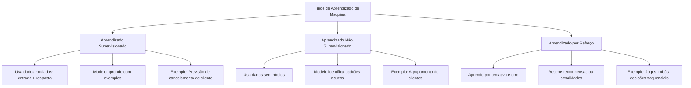

# Documentação e Recursos Úteis sobre fundamentos de IA
> Resumo da documentção oficial da Azure Machine Learning - IA900

### Conceitos Iniciais: oque é IA e IA Generativa?
###### IA: campo da ciência da computação que desenvolve sistemas capazes de imitar comportamentos humanos, como pensar, aprender, tomar decisões e resolver problemas, utilizando dados e algoritmos.
###### IA generativa:  ramo da Inteligência Artificial focado em criar novos conteúdos originais — como textos, imagens, códigos, sons e outros formatos — a partir de entradas com dados estruturados.
###### Ela não apenas interpreta informações, mas também gera respostas criativas e contextualizadas, simulando a produção humana com o auxílio de modelos de linguagem grandes (LLMs) como os modelos GPT.

### LLMS (Modelos de linguagem grandes):
#####  Oque são?
###### Modelos de inteligência artificial treinados com enormes volumes de dados textuais para realizar tarefas relacionadas à compreensão e geração de texto.
##### Funcionam em várias etapas, de forma geral dividimos em:

| LLMS  | Etapa |
| ------------- | ------------- |
| Tokenização  | Dividir o texto em partes numericamente codificadas  |
| Inserções  | Representar tokens como vetores que carregam significado  |
| Atenção  | Priorizar tokens importantes para o contexto  |
| Decodificação  | Gerar a resposta ou sequência final  |

### Copilotos: 
###### Copilotos são assistentes de IA integrados a aplicativos que auxiliam os usuários em tarefas específicas, gerando conteúdo com base em prompts.
###### Exemplos: Microsoft Edge, Microsoft Bing, GitHub Copilot

### Azure OpenAI:
#### Oque é o Azure OpenAI?
###### É o serviço da Microsoft que oferece acesso em nuvem aos modelos da OpenAI, como o GPT-4, GPT-3.5, DALL·E, entre outros.

#### Funcionalidades do Azure OpenAI?
###### - Geração de Texto
###### - Geração de Código
###### - Geração e Edição de Imagens

### Cargas de trabalho comuns de IA:

| Carga de trabalho  | Função |
| ------------- | ------------- |
| Machine Learning  | Criar modelos preditivos com base em dados e estatísticas  |
| Visão Computacional  | Permitir que a IA entenda e interprete o mundo visual, usando câmeras, vídeos e imagens |
| Processamento de Linguagem (PLN)  | Fazer com que a IA compreenda textos e falas humanas e responda de forma apropriada  |
| Inteligência de Documentos  | Lidar com grandes volumes de dados em formulários e documentos, extraindo e processando informações  |
| Mineração de Conhecimento  |  Organizar e extrair informações úteis de grandes volumes de dados (muitas vezes não estruturados)  |
| IA Generativa  |Criar conteúdos novos e originais em diferentes formatos: texto, imagem, código e outros |

### Princípios da IA responsável:
###### - Imparcialidade
###### - Confiabilidade e Segurança
###### - Privacidade e Segurança
###### - Inclusão
###### - Transparência
###### - Responsabilidade

### Aprendizado de máquina (Machine Learning):
#### Oque é?
###### É um método de Inteligência Artificial em que os sistemas aprendem a realizar tarefas com base em dados, sem serem programados diretamente para cada ação. 
###### O modelo é treinado com exemplos e passa a reconhecer padrões, fazer previsões ou tomar decisões com base nos dados recebidos.
#### Tipos de aprendizado de máquina e suas características:

### Aprendizado Profundo (Deep Learning):
###### Subárea do aprendizado de máquina que usa redes neurais artificiais com múltiplas camadas (semelhantes ao cérebro humano) para aprender representações complexas dos dados.

### Processamento de linguagem Natural x Processamento de linguagem Coloquial:
##### Processamento de linguagem Natural:
###### Permite que computadores compreendam, interpretem e respondam a textos e falas humanos de forma útil e contextualizada. 
##### Processamento de linguagem Coloquial:
###### Permite entender expressões informais, gírias, erros gramaticais e variações do idioma como ele é usado no dia a dia pelas pessoas.

### Azure Machine Learning:
###### Plataforma de nuvem da Microsoft voltada para o desenvolvimento, treinamento, implantação e gerenciamento de modelos de aprendizado de máquina.

### Documentação oficial e links úteis :
##### https://learn.microsoft.com/en-us/training/paths/introduction-to-ai-on-azure
##### https://microsoftlearning.github.io/mslearn-ai-fundamentals/Instructions/Labs/12-generative-ai.html
##### https://microsoftlearning.github.io/mslearn-ai-studio/Instructions/01-Explore-ai-studio.html
##### https://microsoftlearning.github.io/mslearn-ai-studio/Instructions/06-Explore-content-filters.html
##### https://microsoftlearning.github.io/mslearn-ai-fundamentals/Instructions/Labs/09-speech.html
##### https://microsoftlearning.github.io/mslearn-ai-fundamentals/Instructions/Labs/06-text-analysis.html
##### https://microsoftlearning.github.io/mslearn-ai-fundamentals/Instructions/Labs/01-machine-learning.html
##### https://microsoftlearning.github.io/mslearn-ai-fundamentals/Instructions/Labs/02-content-safety.html
##### ml.azure.com/?azure-portal=true
##### https://contentsafety.cognitive.azure.com/?azure-portal=true
